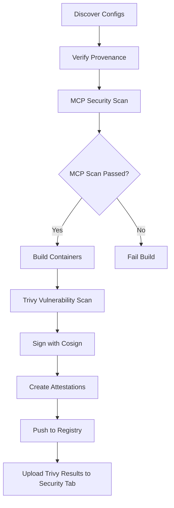

# Dockyard - MCP Server Container Builder

> **A centralized repository for packaging Model Context Protocol (MCP) servers into containers**

Dockyard automatically builds and publishes container images for MCP servers that aren't already containerized. It uses [ToolHive](https://docs.stacklok.com/toolhive) to build containers from protocol schemes and provides a simple YAML-based configuration system.

## 🚀 Quick Start

Want to add your MCP server? Just create a YAML file in the appropriate protocol directory and submit a PR! Our automated CI/CD pipeline will build and publish the container image automatically.

## 📦 Supported Protocols

- **`npx://`** - Node.js packages from npm registry
- **`uvx://`** - Python packages using uv package manager
- **`go://`** - Go packages and modules

## 🏗️ Available MCP Servers

| Server | Protocol | Container Image | Description |
|--------|----------|-----------------|-------------|
| [Context7](https://github.com/upstash/context7-mcp) | npx | `ghcr.io/stacklok/dockyard/npx/context7:1.0.14` | Upstash vector search and context management |
| [AWS Documentation](https://github.com/awslabs/mcp) | uvx | `ghcr.io/stacklok/dockyard/uvx/aws-documentation-mcp-server:1.1.2` | AWS Labs documentation server |

## 🤝 Contributing Your Own MCP Server

Adding your MCP server to Dockyard is simple! Follow these steps:

### Step 1: Choose the Right Protocol Directory

- **`npx/`** - For Node.js packages published to npm
- **`uvx/`** - For Python packages published to PyPI
- **`go/`** - For Go modules and packages

### Step 2: Create Your MCP Server Directory and Configuration

Create a new directory for your MCP server in the appropriate protocol folder, then add a `spec.yaml` file:

```bash
# Create directory structure
mkdir -p {protocol}/{your-server-name}

# Create spec.yaml file
```

The `spec.yaml` file should have this structure:

```yaml
# Comments are encouraged! Describe what your MCP server does
# Package URL: https://...
# Repository: https://...
# Will build as: ghcr.io/stacklok/dockyard/{protocol}/{name}:{version}

metadata:
  name: your-server-name           # Required: Unique server name
  description: "Brief description" # Optional: What does your server do?
  version: "1.0.0"                # Optional: Server version
  protocol: npx                   # Required: npx, uvx, or go

spec:
  package: "your-package-name"    # Required: Package name from registry
  version: "1.0.0"               # Required: Specific version to build
  args:                          # Optional: Additional arguments for the package
    - "arg1"                     # Arguments are passed to the entrypoint
    - "arg2"

provenance:                       # Optional but recommended
  repository_uri: "https://github.com/user/repo"  # Expected source repository (used for verification)
  repository_ref: "refs/tags/v1.0.0"              # Git tag/branch/commit

  # Attestation information (optional - documents package provenance)
  attestations:
    available: true              # Whether the package has provenance attestations
    verified: true               # Whether attestations have been cryptographically verified
    publisher:
      kind: "GitHub"            # Publisher type (e.g., GitHub, GitLab)
      repository: "user/repo"   # Publisher repository
      workflow: ".github/workflows/release.yml"  # Publishing workflow
```

### Step 3: Protocol-Specific Examples

#### NPX (Node.js) Example

Directory structure:
```
npx/
└── my-node-server/
    └── spec.yaml
```

Content of `npx/my-node-server/spec.yaml`:
```yaml
# NPM package: https://www.npmjs.com/package/@your-org/mcp-server
metadata:
  name: my-node-server
  description: "My awesome Node.js MCP server"
  version: "2.1.0"
  protocol: npx

spec:
  package: "@your-org/mcp-server"  # NPM package name
  version: "2.1.0"
  args:                            # Optional: Add required CLI arguments
    - "start"                      # For packages that need specific commands

provenance:
  repository_uri: "https://github.com/your-org/mcp-server"
  repository_ref: "refs/tags/v2.1.0"
```

**Real-world example** (LaunchDarkly MCP server):
```yaml
# Some packages require specific CLI arguments to run
# These are baked into the container entrypoint
spec:
  package: "@launchdarkly/mcp-server"
  version: "0.4.2"
  args:
    - "start"  # Required by LaunchDarkly's CLI
# Results in: ENTRYPOINT ["npx", "@launchdarkly/mcp-server", "start"]
```

#### UVX (Python) Example

Directory structure:
```
uvx/
└── my-python-server/
    └── spec.yaml
```

Content of `uvx/my-python-server/spec.yaml`:
```yaml
# PyPI package: https://pypi.org/project/your-mcp-server/
metadata:
  name: my-python-server
  description: "My awesome Python MCP server"
  version: "1.5.2"
  protocol: uvx

spec:
  package: "your-mcp-server"      # PyPI package name
  version: "1.5.2"

provenance:
  repository_uri: "https://github.com/your-org/python-mcp-server"
  repository_ref: "refs/tags/v1.5.2"
```

#### Go Example

Directory structure:
```
go/
└── my-go-server/
    └── spec.yaml
```

Content of `go/my-go-server/spec.yaml`:
```yaml
# Go module: go get github.com/your-org/go-mcp-server
metadata:
  name: my-go-server
  description: "My awesome Go MCP server"
  version: "0.3.1"
  protocol: go

spec:
  package: "github.com/your-org/go-mcp-server"  # Go module path
  version: "v0.3.1"                            # Go version tag

provenance:
  repository_uri: "https://github.com/your-org/go-mcp-server"
  repository_ref: "refs/tags/v0.3.1"
```

### Step 4: Submit Your Pull Request

1. Fork this repository
2. Create your server directory and `spec.yaml` file in the appropriate protocol directory
3. Submit a pull request with:
   - Clear title: "Add [Your Server Name] MCP server"
   - Description of what your server does
   - Link to the package registry and source repository

**Note**: Your MCP server will be automatically scanned for security vulnerabilities. The PR will only be mergeable if the security scan passes.

### Step 5: Automated Building

Once your PR passes security scanning and is merged:
- ✅ Security scan ensures no vulnerabilities
- 🤖 GitHub Actions automatically detects your new configuration
- 🏗️ Builds a container image using ToolHive
- 📦 Publishes to `ghcr.io/stacklok/dockyard/{protocol}/{name}:{version}`
- 🔄 Renovate keeps your package version up-to-date automatically

## 🔒 Security Scanning

Dockyard automatically scans all MCP servers for security vulnerabilities before building containers using [Cisco AI Defense mcp-scanner](https://github.com/cisco-ai-defense/mcp-scanner). This ensures that only secure MCP servers are deployed.

### What We Scan For

- **Prompt Injection Risks**: Detects dangerous words or patterns in tool descriptions that could be exploited
- **Toxic Flows**: Identifies combinations of tools that could lead to destructive behaviors
- **Tool Poisoning**: Checks for malicious tool implementations
- **Cross-Origin Escalation**: Detects potential privilege escalation vulnerabilities
- **Rug Pull Attacks**: Identifies suspicious patterns that could indicate malicious intent

### Security Requirements

All MCP servers must pass security scanning before being merged. If vulnerabilities are detected:
- The CI pipeline will fail
- A detailed report will be posted as a PR comment
- The vulnerabilities must be addressed OR explicitly allowed before the PR can be merged

### Allowing Known Issues

Some security warnings may be false positives, especially for containerized deployments where additional sandboxing is provided. You can explicitly allow specific security issues by adding a `security` section to your YAML configuration:

```yaml
security:
  # Security allowlist for known issues that are acceptable in this context
  allowed_issues:
    - code: "AITech-1.1"
      reason: "Tool description contains imperative instructions for AI agents which are necessary for proper operation"
    - code: "AITech-9.1"
      reason: "Destructive toxic flow is mitigated by container sandboxing - code execution is isolated from host system"
```

Each allowed issue must include:
- `code`: The issue code reported by mcp-scanner (e.g., AITech-1.1, AITech-8.2, AITech-9.1)
- `reason`: A clear explanation of why this issue is acceptable in your specific context

### Security Report Example

When vulnerabilities are found, you'll see a detailed report in your PR:

```
## 🔒 MCP Security Scan Results

### ❌ your-mcp-server
- **Status**: Failed
- **Tools scanned**: 3
- **Vulnerabilities found**: 2

**Security issues detected:**
- **[W001]** Tool description contains dangerous words that could be used for prompt injection
- **[TF002]** Destructive toxic flow detected
```

If issues are allowlisted, they won't fail the build:

```
ℹ️  Allowed security issues found in your-mcp-server:
  - [W001] Tool description contains dangerous words...
    Reason: Tool description contains imperative instructions for AI agents which are necessary for proper operation
✅ All issues are allowlisted - build can proceed (3 tools scanned)
```

## 🔐 Container Security & Attestations

All container images built by Dockyard are signed and attested using Sigstore for supply chain security. Each image includes:

- **Container Signatures**: Images are signed with Sigstore/Cosign
- **SBOM Attestation**: Software Bill of Materials (SPDX format) for dependency tracking
- **Build Provenance**: Build provenance attestation for build integrity
- **Security Scan Attestation**: MCP security scan results are attested

### Verifying Container Signatures

To verify that an image was built and signed by Dockyard:

```bash
# Install cosign if you haven't already
brew install cosign  # or see https://docs.sigstore.dev/cosign/installation/

# Verify image signature
cosign verify \
  --certificate-identity-regexp "https://github.com/stacklok/dockyard/.github/workflows/build-containers.yml@refs/heads/.*" \
  --certificate-oidc-issuer https://token.actions.githubusercontent.com \
  ghcr.io/stacklok/dockyard/npx/context7:1.0.14
```

### Verifying Attestations

#### Build Provenance & SBOM Attestations (OCI Artifacts)

Docker buildx automatically creates and pushes SBOM (SPDX format) and provenance attestations as OCI artifacts. These are stored alongside the image and can be inspected using Docker buildx:

```bash
# View SBOM attestation for all platforms
docker buildx imagetools inspect \
  ghcr.io/stacklok/dockyard/npx/context7:1.0.14 \
  --format "{{ json .SBOM }}"

# View Provenance attestation for all platforms
docker buildx imagetools inspect \
  ghcr.io/stacklok/dockyard/npx/context7:1.0.14 \
  --format "{{ json .Provenance }}"

# Get the raw SBOM for a specific platform
docker buildx imagetools inspect \
  ghcr.io/stacklok/dockyard/npx/context7:1.0.14 \
  --format '{{ range .SBOM }}{{ if eq .Platform "linux/amd64" }}{{ .Data }}{{ end }}{{ end }}' | base64 -d | jq

# Get the raw Provenance for a specific platform
docker buildx imagetools inspect \
  ghcr.io/stacklok/dockyard/npx/context7:1.0.14 \
  --format '{{ range .Provenance }}{{ if eq .Platform "linux/amd64" }}{{ .Data }}{{ end }}{{ end }}' | base64 -d | jq
```

Note: These attestations are stored as OCI artifacts in the registry, not as Sigstore attestations. They provide supply chain transparency but are verified differently than cosign attestations.

#### Security Scan Attestation (SCAI)

MCP security scan results are attested using the [SCAI (Software Supply Chain Attribute Integrity)](https://github.com/in-toto/attestation/blob/main/spec/predicates/scai.md) predicate type, an official in-toto format recognized by policy engines like Kyverno, OPA, and Gatekeeper.

```bash
# Verify and retrieve security scan attestation (if available)
cosign verify-attestation \
  --type https://in-toto.io/attestation/scai/v0.3 \
  --certificate-identity-regexp "https://github.com/stacklok/dockyard/.github/workflows/build-containers.yml@refs/heads/.*" \
  --certificate-oidc-issuer https://token.actions.githubusercontent.com \
  ghcr.io/stacklok/dockyard/npx/context7:1.0.14

# Extract scan conditions from attestation
cosign download attestation ghcr.io/stacklok/dockyard/npx/context7:1.0.14 | \
  jq -r 'select(.payloadType == "application/vnd.in-toto+json") | .payload | @base64d | fromjson | .predicate.attributes[0].conditions'
```

For detailed attestation schema, policy examples, and verification commands, see [docs/attestations.md](docs/attestations.md).

Note: Security scan attestations are only created when the MCP security scan runs and produces results for that specific image build.

### Container Vulnerability Scanning

All built container images are scanned for vulnerabilities using [Trivy](https://trivy.dev/), checking for:

- **Vulnerabilities**: CVEs in OS packages and application dependencies (CRITICAL, HIGH, MEDIUM severity)
- **Secrets**: Exposed API keys, tokens, credentials
- **Misconfigurations**: Security issues in container configuration

Scan results are:
- Uploaded to the **GitHub Security** tab for each repository
- Available in the **Security** → **Code scanning** section
- Non-blocking for PRs (informational only)
- Automatically run on every build and weekly via periodic scans

To view scan results:
```bash
# Navigate to: https://github.com/stacklok/dockyard/security/code-scanning
# Filter by "trivy-{server-name}" to see specific results
```

Trivy scans run:
1. **On every PR**: Provides immediate feedback on new/changed containers
2. **On main branch**: Scans all published images after build
3. **Weekly (Monday 2am UTC)**: Comprehensive periodic scans to catch newly disclosed CVEs
4. **Manual trigger**: Run periodic scans on-demand via GitHub Actions

### Security Guarantees

When you use a Dockyard container image, you can be confident that:

1. **Source Integrity**: The image was built from the exact source code in this repository
2. **Build Transparency**: Full build provenance is available and verifiable
3. **MCP Security Scanning**: The MCP server was scanned for security vulnerabilities before packaging
4. **Container Vulnerability Scanning**: Container images are scanned with Trivy for CVEs, secrets, and misconfigurations
5. **Dependency Tracking**: Complete SBOM is available for vulnerability management
6. **Non-repudiation**: Signatures prove the image came from our CI/CD pipeline
7. **Continuous Monitoring**: Weekly scans catch newly disclosed vulnerabilities in published images

## 🏗️ How It Works

1. **Detection**: GitHub Actions detects changes to YAML files
2. **Provenance Verification**: Verifies package provenance using `dockhand verify-provenance` (informational)
3. **MCP Security Scan**: Runs Cisco AI Defense mcp-scanner to check for MCP-specific vulnerabilities (blocking)
4. **Validation**: Validates YAML structure and required fields
5. **Protocol Scheme**: Constructs protocol scheme (e.g., `npx://@upstash/context7-mcp@1.0.14`)
6. **Container Build**: Uses ToolHive's `BuildFromProtocolSchemeWithName` function (only if security scan passes)
7. **Container Vulnerability Scan**: Scans built images with Trivy for CVEs, secrets, and misconfigurations (non-blocking)
8. **Attestation**: Creates and signs SBOM, provenance, and security scan attestations
9. **Publishing**: Pushes to GitHub Container Registry with automatic tagging
10. **Updates**: Renovate automatically creates PRs for new package versions

### CI/CD Pipeline

The CI/CD pipeline runs in this order:



**Provenance verification** is informational and does not block builds - it helps track which packages have cryptographic verification available.

## 📋 Container Image Naming

All containers follow this naming pattern:
```
ghcr.io/stacklok/dockyard/{protocol}/{name}:{version}
```

Examples:
- `ghcr.io/stacklok/dockyard/npx/context7:1.0.14`
- `ghcr.io/stacklok/dockyard/uvx/aws-documentation-mcp-server:1.1.2`
- `ghcr.io/stacklok/dockyard/go/my-mcp-server:latest`

## 🔍 Package Provenance Verification

Dockyard includes built-in support for verifying package provenance using cryptographic attestations. This helps ensure supply chain security by verifying the authenticity and origin of packages.

### Checking Provenance

Use the `verify-provenance` command to check if a package has provenance information:

```bash
# Verify npm package provenance
./build/dockhand verify-provenance -c npx/context7/spec.yaml

# Verify PyPI package provenance
./build/dockhand verify-provenance -c uvx/mcp-clickhouse/spec.yaml

# Verbose output with details
./build/dockhand verify-provenance -c uvx/aws-documentation/spec.yaml -v
```

### Provenance Coverage

Current provenance coverage for packaged MCP servers:

**npm packages (npx/) - 17 total:**
- 16 packages (94%) have **legacy npm signatures** - detected but not cryptographically verified
- 1 package (6%) has **modern attestations** - @jetbrains/mcp-proxy with SLSA provenance

**PyPI packages (uvx/) - 12 total:**
- 3 packages (25%) have **PEP 740 attestations** with cryptographic verification
  - AWS Labs packages (aws-documentation, aws-diagram)
  - ClickHouse (mcp-clickhouse)
- 9 packages (75%) have no provenance

### What Gets Verified

**For npm:**
- **Legacy signatures** (16 packages): Detection only - confirms they exist
- **Modern attestations** (1 package): Downloads Sigstore bundles, verifies cryptographically

**For PyPI with attestations (3 packages):**
1. **Cryptographic signatures** using Sigstore
2. **Publisher identity** (GitHub Actions from the expected repository)
3. **Transparency logs** (Rekor entries)
4. **Certificate validity** via Sigstore trust roots
5. **Artifact integrity** (SHA256 hashes match)

### Measuring Provenance

Scripts are available in `scripts/` to measure provenance coverage:

```bash
# Check npm provenance for all packages
python3 scripts/check-npm-provenance.py

# Check PyPI provenance for all packages
python3 scripts/check-pypi-provenance.py
```

Results are saved to JSON files for tracking over time.

## 🛠️ Local Development

### Prerequisites
- Go 1.21+
- Docker or Podman
- ToolHive library

### Build and install dockhand:

```bash
go build -o dockhand ./cmd/dockhand
# Or install globally
go install ./cmd/dockhand
```

### Generate a Dockerfile:

```bash
# Generate Dockerfile to stdout
./dockhand build -c npx/context7/spec.yaml

# Save Dockerfile to file
./dockhand build -c npx/context7/spec.yaml -o Dockerfile
```

### Build with custom tag:

```bash
./dockhand build -c npx/context7/spec.yaml -t my-custom-tag:latest
```

## 🔧 Dependencies

- **[ToolHive](https://github.com/stacklok/toolhive)** - Container building from protocol schemes
- **[gopkg.in/yaml.v3](https://gopkg.in/yaml.v3)** - YAML configuration parsing
- **[Renovate](https://renovatebot.com/)** - Automated dependency updates
- **[Cisco AI Defense mcp-scanner](https://github.com/cisco-ai-defense/mcp-scanner)** - Security vulnerability scanning for MCP servers
