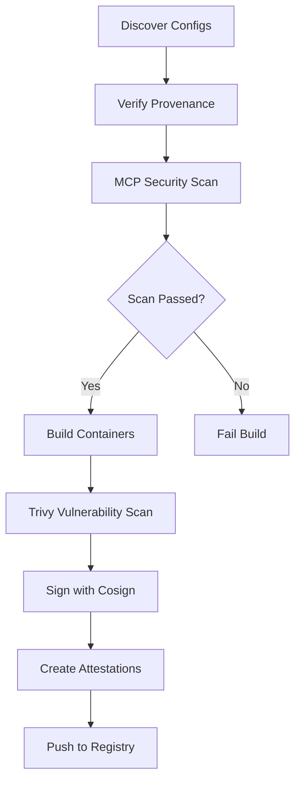

# Adding MCP Servers to Dockyard

This guide walks you through packaging and contributing your MCP server to Dockyard.

## Overview

Adding your MCP server is simple:
1. Create a `spec.yaml` configuration file
2. Submit a pull request
3. CI/CD automatically builds, scans, and publishes your container

## Directory Structure

```
{protocol}/{server-name}/spec.yaml
```

Choose the protocol directory based on your package type:
- `npx/` - Node.js packages from npm
- `uvx/` - Python packages from PyPI
- `go/` - Go modules

## spec.yaml Reference

```yaml
# {Server Name} MCP Server Configuration
# Package: {package-registry-url}
# Repository: {source-repository-url}
# Will build as: ghcr.io/stacklok/dockyard/{protocol}/{name}:{version}

metadata:
  name: your-server-name           # Required: Unique server name
  description: "Brief description" # Optional: What does your server do?
  version: "1.0.0"                 # Optional: Server version
  protocol: npx                    # Required: npx, uvx, or go

spec:
  package: "your-package-name"     # Required: Package name from registry
  version: "1.0.0"                 # Required: Specific version to build
  args:                            # Optional: CLI arguments for the package
    - "arg1"                       # Passed to the entrypoint command
    - "arg2"

provenance:                        # Optional but recommended
  repository_uri: "https://github.com/user/repo"
  repository_ref: "refs/tags/v1.0.0"

  # Attestation information (if available)
  attestations:
    available: true                # Whether the package has provenance attestations
    verified: true                 # Whether you've verified the attestations
    publisher:
      kind: "GitHub"              # Publisher type (e.g., GitHub, GitLab)
      repository: "user/repo"     # Publisher repository
      workflow: "release.yml"     # Publishing workflow (optional)

# Optional: Security scan configuration
security:
  # Allowlist for known false positives or acceptable issues
  allowed_issues:
    - code: "AITech-1.1"
      reason: "Explanation of why this issue is acceptable"
  # Mock environment variables for servers that require them during scanning
  mock_env:
    - name: API_URL
      value: "https://mock-api.example.com"
      description: "Required for server startup - mock value for scanning"
```

## Protocol-Specific Examples

### Node.js (npx)

```yaml
# NPM package: https://www.npmjs.com/package/@your-org/mcp-server
metadata:
  name: my-node-server
  description: "My awesome Node.js MCP server"
  version: "2.1.0"
  protocol: npx

spec:
  package: "@your-org/mcp-server"  # NPM package name
  version: "2.1.0"

provenance:
  repository_uri: "https://github.com/your-org/mcp-server"
  repository_ref: "refs/tags/v2.1.0"
```

Some packages require specific CLI arguments:

```yaml
# LaunchDarkly requires the "start" command
spec:
  package: "@launchdarkly/mcp-server"
  version: "0.4.2"
  args:
    - "start"
# Results in: ENTRYPOINT ["npx", "@launchdarkly/mcp-server", "start"]
```

### Python (uvx)

```yaml
# PyPI package: https://pypi.org/project/your-mcp-server/
metadata:
  name: my-python-server
  description: "My awesome Python MCP server"
  version: "1.5.2"
  protocol: uvx

spec:
  package: "your-mcp-server"       # PyPI package name
  version: "1.5.2"

provenance:
  repository_uri: "https://github.com/your-org/python-mcp-server"
  repository_ref: "refs/tags/v1.5.2"
```

### Go

```yaml
# Go module: go get github.com/your-org/go-mcp-server
metadata:
  name: my-go-server
  description: "My awesome Go MCP server"
  version: "0.3.1"
  protocol: go

spec:
  package: "github.com/your-org/go-mcp-server"  # Go module path
  version: "v0.3.1"                              # Go version tag

provenance:
  repository_uri: "https://github.com/your-org/go-mcp-server"
  repository_ref: "refs/tags/v0.3.1"
```

## Step-by-Step Process

### 1. Find Package Information

```bash
# Python
curl -s https://pypi.org/pypi/{package}/json | jq -r '.info.version'

# Node.js
npm view {package} version
```

### 2. Create Directory Structure

```bash
mkdir -p {protocol}/{server-name}
```

### 3. Create spec.yaml

Use the template above, filling in your package details.

### 4. Verify Provenance (Recommended)

Check if your package has provenance attestations:

```bash
# Build dockhand first
go build -o build/dockhand ./cmd/dockhand

# Verify provenance
./build/dockhand verify-provenance -c {protocol}/{server-name}/spec.yaml -v
```

Document any provenance information in your spec.yaml. See [Package Provenance](provenance.md) for details.

### 5. Test Locally

```bash
# Validate spec and generate Dockerfile
task build -- {protocol}/{server-name}

# Run security scan
task scan -- {protocol}/{server-name}

# Optional: Build and test container image
task test-build -- {protocol}/{server-name}
```

### 6. Submit Pull Request

1. Fork the repository
2. Create your server directory and spec.yaml
3. Submit a PR with:
   - Clear title: "Add [Your Server Name] MCP server"
   - Description of what your server does
   - Link to the package registry and source repository

## CI/CD Pipeline

When you submit a PR, the following happens automatically:



### Security Scanning

All MCP servers are scanned for security vulnerabilities using [mcp-scanner](https://github.com/cisco-ai-defense/mcp-scanner). The scan is **blocking** - your PR cannot merge if it fails.

If your scan finds issues that are false positives or acceptable in your context, add them to the security allowlist:

```yaml
security:
  allowed_issues:
    - code: "AITech-1.1"
      reason: "Tool description contains imperative instructions necessary for proper operation"
    - code: "AITech-9.1"
      reason: "Destructive flow mitigated by container sandboxing"
```

### Servers Requiring Environment Variables

Some MCP servers require environment variables to start (e.g., API URLs, tokens). Since the security scanner needs to start the server to discover its tools, you can provide mock values that allow the server to start without functional credentials:

```yaml
security:
  mock_env:
    - name: SEARXNG_URL
      value: "https://mock-searxng.example.com"
      description: "SearXNG instance URL - mock for scanning"
    - name: API_TOKEN
      value: "mock-token-for-scanning-00000000"
      description: "API token - mock value, not a real credential"
```

**Important notes about mock_env:**
- Mock values are **not secrets** - they are committed to the repository
- Values should be obviously fake (use `mock-`, placeholder UUIDs, example.com domains)
- Purpose is to allow server startup for scanning, not functional operation
- Servers still need to pass security scans or allowlist known issues

See [Security Overview](security.md) for more details on what we scan for.

### After Merge

Once merged:
- Container published to `ghcr.io/stacklok/dockyard/{protocol}/{name}:{version}`
- Renovate automatically creates PRs for version updates
- Trivy scans run weekly to catch new CVEs

## Local Development

### Build dockhand CLI

```bash
go build -o build/dockhand ./cmd/dockhand
```

### Generate Dockerfile

```bash
# Generate to stdout
./build/dockhand build -c npx/context7/spec.yaml

# Save to file
./build/dockhand build -c npx/context7/spec.yaml -o Dockerfile
```

### Build with Custom Tag

```bash
./build/dockhand build -c npx/context7/spec.yaml -t my-custom-tag:latest
```

### CLI Flags

| Flag | Description |
|------|-------------|
| `-c, --config` | YAML spec file (required) |
| `-o, --output` | Output file (default: stdout) |
| `-t, --tag` | Custom image tag |
| `-v, --verbose` | Verbose output |
| `--check-provenance` | Require provenance verification |
| `--warn-no-provenance` | Warn if no provenance (default: true) |

## Troubleshooting

| Issue | Solution |
|-------|----------|
| Package not found | Verify exact package name in registry |
| Build fails | Check Dockerfile syntax with `dockhand build -c spec.yaml` |
| Version error | Ensure version exists in package registry |
| Wrong protocol | Verify package type matches directory (uvx/npx/go) |
| Security scan fails | Review issues, allowlist false positives with explanation |

## Key Rules

1. **Always use exact versions** - no ranges or "latest" tags
2. **Test locally before committing**
3. **Include all metadata fields**
4. **Use correct protocol directory** (uvx/npx/go)
5. **Reference official package registries** in comments
6. **Verify provenance** when available

## What's Next?

- [Package Provenance](provenance.md) - Understanding provenance verification
- [Security Overview](security.md) - What we scan for and why
- [Container Attestations](attestations.md) - Build attestations and policy enforcement
