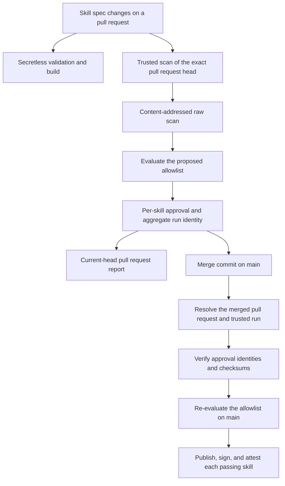

# Trusted skill scan workflow

Dockyard makes the LLM-backed security decision for a skill on the exact pull
request head that reviewers see. After merge, the release workflow verifies
and reuses that decision instead of asking the nondeterministic analyzers to
make it again.

This page describes the GitHub Actions workflows, artifact identities, and
failure behavior that preserve that decision from pull request to published
OCI artifact.

## Workflow overview

Four workflows participate in a normal skill change:

| Workflow | Trigger | Responsibility |
| --- | --- | --- |
| `check-skills.yml` | `pull_request` | Validates and builds proposed skills without credentials or publishing access. |
| `trusted-skill-scan.yml` | `pull_request_target` | Runs the trusted scanner, evaluates the proposed allowlist, and records approval artifacts for the exact pull request head. |
| `skill-scan-report.yml` | `workflow_run` | Reports results on the pull request if the scanned head is still current. |
| `build-skills.yml` | Push to `main` | Verifies the pull request approval, publishes each passing skill, and creates its security attestation. |

The skill version workflow can add a second commit to Renovate and Dependabot
pull requests. The trusted scan workflow coordinates scans across those heads
so the current head has a visible pending check while it waits for reusable
results from the earlier head.

## Trust boundary

`check-skills.yml` checks out pull request code, so it has read-only
permissions and no credentials. It validates specifications and confirms that
the proposed skill can be packaged, but it does not run the LLM-backed scanner
or publish artifacts.

`trusted-skill-scan.yml` has access to the scanner credential. It checks out
the workflow and scanner implementation from the trusted base commit. It
fetches each proposed `spec.yaml` through the GitHub contents API and treats
the file as data. Pull request code is never executed in this workflow.

The trusted workflow also enforces the following boundaries:

- A pull request cannot change both a skill specification and
  `trusted-skill-scan.yml`, `build-skills.yml`, or a file under
  `scripts/skill-scan/`.
- `spec.repository` must be a public HTTPS URL, and `spec.ref` must be a full
  commit SHA.
- `spec.path` must be a safe repository-relative path.
- The selected upstream skill tree cannot contain symbolic links.
- `security.insecure_ignore: true` cannot approve a trusted scan.
- A same-repository pull request can scan at most 50 changed skills. A fork can
  scan at most 10.

## Pull request scans

The trusted workflow creates one scan matrix entry per changed skill
specification. The scanner uses three LLM consensus runs and blocks an
unallowlisted finding at `HIGH` severity or above. It also fails if the scanner
does not report the required LLM and meta analyzers.

### Coordinating multiple pull request heads

Renovate first updates `spec.ref`. The skill version workflow can then commit
the corresponding `spec.version` changes, which produces another trusted scan
run for the same pull request.

After discovery, the `Trusted skill scan coordination` job appears on every
skill-changing head. It repeatedly finds the newest earlier active trusted
scan for that pull request and waits until no earlier run remains. This
serializes a burst of heads rather than allowing several scan matrices to start
when the oldest run finishes. The coordination job waits for up to 75 minutes
and has an 80-minute job timeout.

After coordination, each matrix entry looks for a content-addressed raw scan.
The cache identity includes the upstream repository, ref, path, resolved tree,
scanner version, scan profile, workflow, requirements, and scanner wrapper.
An exact match restores the raw scanner output and verifies its manifest and
checksum. The workflow then evaluates that output against the current head's
proposed allowlist. This lets an autofix head reuse the expensive scan while
still receiving an approval bound to its own specification and head SHA.

### Reporting results

`skill-scan-report.yml` starts after a trusted scan completes. It downloads the
report context and scan summaries, then updates the pull request's single
**Skill Security Scan Results** comment. Before writing, it compares the
recorded head SHA with the current pull request head. A result for an older
head is skipped instead of being presented as current.

## Artifact identities

Trusted scan artifacts expire after 30 days.

| Artifact | Contents and purpose |
| --- | --- |
| `trusted-scan-context-pr-<PR>-<HEAD>` | Pull request number, head SHA, and expected scan configurations for reporting. |
| `trusted-raw-skill-scan-v1-<DIGEST>` | Raw scanner output, scanner version, and a manifest bound to the content-addressed scan identity. |
| `trusted-skill-scan-<SKILL>` | Raw output, evaluated summary, scanner version, and `scan-approval.json` for one skill. |
| `trusted-scan-identity-pr-<PR>-<HEAD>` | Aggregate marker created only after every scan matrix entry succeeds. |
| `skill-scan-<SKILL>` | Main-run scan result consumed by the per-skill publish gate and SCAI attestation step. |

`scan-approval.json` binds the result to the pull request number, head SHA, run
ID, run attempt, exact specification, upstream source and tree, scanner
profile, and trusted implementation files. It also records checksums for the
raw result and evaluated summary. The main workflow reconstructs and verifies
these values before accepting the approval.

## Merge and publication

On a skill-changing push to `main`, `build-skills.yml` identifies exactly one
merged pull request whose merge commit matches the push SHA. It finds the
latest trusted scan with the expected pull request number and head SHA, waits
for that run to finish if necessary, and requires a successful aggregate run
identity.

Each skill scan job downloads its approval artifact and verifies all recorded
identities and checksums against the merged specification and current trusted
implementation. A verified result is copied into the main run and evaluated
against the allowlist again. The fresh LLM scanner remains skipped.

If the trusted run or aggregate identity is not visible, the main workflow can
run the current trusted scanner as a fallback. A missing or invalid per-skill
approval also takes this fallback path. The fallback must complete all required
LLM analysis and pass the same allowlist evaluation.

The resolver fails closed when it cannot identify exactly one merged pull
request, when the matching trusted run has an invalid workflow identity or
conclusion, or when the run does not complete within its timeout.

Publication is gated per skill. One failing scan blocks that skill while other
passing matrix entries can still be published. Each published skill receives
its signature, SBOM, build provenance, and SCAI security scan attestation.
Main-branch build runs are queued and are not canceled because every push can
represent a release that must be published and attested.

## Verify a main-branch reuse

Open the `Build Skill Artifacts` run for the merge commit and check the
following jobs:

1. `resolve-pr-scan` logs `Using trusted scan from PR`, followed by the expected
   pull request and trusted run IDs.
1. Every expected `skill-security-scan` matrix entry completes `Download
   trusted pull-request scan` and `Verify trusted pull-request scan`.
1. `Run current trusted scanner` is skipped in those entries.
1. `Evaluate scan results against allowlist` and the per-skill `Pre-flight scan
   gate` succeed before publication.

If the fallback scanner runs, inspect the approval verification step and the
resolver logs before treating the run as an expected reuse.

## Troubleshooting

### The current pull request head remains pending

Open `Trusted skill scan coordination`. A log naming an earlier run means the
current head is waiting for that run to finish and publish reusable raw scans.
The job rechecks all earlier runs every 30 seconds.

### A completed scan did not update the pull request comment

Open the corresponding `Skill Scan Report` run. A `Skipping stale scan report`
message means the pull request received a newer commit before reporting
finished. The report for the current head remains authoritative.

### Main ran the fallback scanner

Check `resolve-pr-scan` for a missing trusted run or aggregate identity. If the
resolver selected a trusted run, inspect `Verify trusted pull-request scan` for
a missing file, source mismatch, checksum mismatch, or trusted implementation
change.

### Some skills published while another was blocked

This is the expected per-skill failure model. Inspect the blocked skill's
`skill-security-scan` job and its `Pre-flight scan gate`. Passing skills do not
depend on the aggregate scan matrix result.

## Related information

- [Security overview](security.md)
- [Adding skills](adding-skills.md)
- [`scripts/skill-scan/README.md`](../scripts/skill-scan/README.md)
